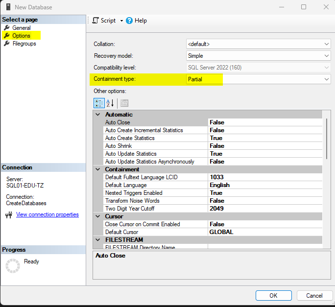

## Database aanmaken
Op de server heb ik een gebruiker aangemaakt die alleen nieuwe databases mag aanmaken (alleen lid van dbcreator-rol):

Deze kun je gebruiken om met de test-server te verbinden en een eigen database aan te maken:
- open SQL Server Management Studio (SSMS)
  - heb je die nog niet, dan kun je deze installeren via de Company Portal
- verbind via SSMS met de server
- rechtsklik op **Databases** en kies voor **New Database...**
- geef de database een eigen naam (liefst met jouw eigen naam erin, zodat we die later kunnen herkennen)
- 

## Partial containment
We zorgen ervoor dat alles in dezelfde database komt te staan via **Partial Containment**

## Eigen database-gebruiker aanmaken

