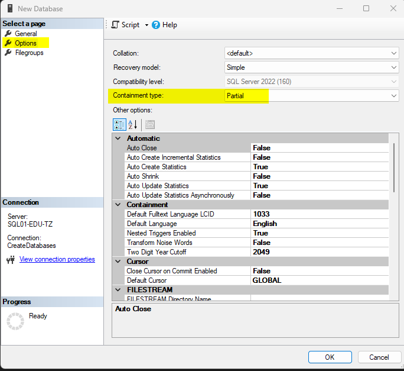

## Database aanmaken
Op de server heb ik een gebruiker aangemaakt die alleen nieuwe databases mag aanmaken (alleen lid van **dbcreator**-rol):

Deze kun je gebruiken om met de test-server te verbinden en een eigen database aan te maken:
- open SQL Server Management Studio (SSMS)
  - heb je die nog niet, dan kun je deze installeren via de Company Portal
- [verbind via SSMS met de server](0-inloggen-_op_server.md)
- rechtsklik op **Databases** en kies voor **New Database...**
- geef de database een naam (liefst met jouw eigen naam erin, zodat we die later kunnen herkennen)
- 

## Manieren van inloggen
Er zijn grofweg 2 manieren van inloggen:
- via Windows Authentication
- via SQL Authentication

## Partial containment
Normaal gesproken maak je SQL-gebruikers op de server aan. Wij willen deze graag bij de database houden, dus kiezen we voor **Partial Containment**.

[Maak nu een eigen gebruiker aan](2-gebruiker-aanmaken.md)
